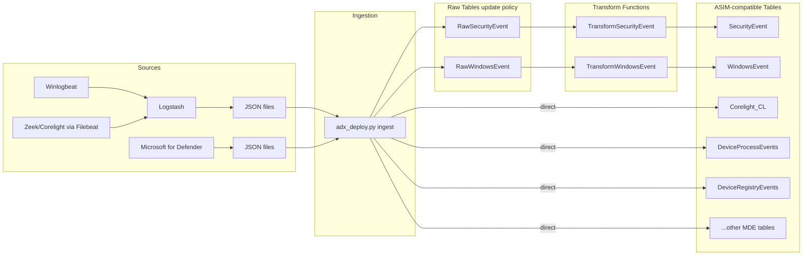

# DetLabs

This is the (temporary?) home for telemetry from interesting techniques. I collected the telemetry using a Ludus range (thanks to [Bad Sector Labs!](https://www.linkedin.com/company/bad-sector-labs-llc)) and a Logstash pipeline.

### Telemetry Pipeline
Logstash performs a lot of transformation, but its not sufficient. The Logstash JSON output is sent to Azure Data Explorer (ADX) where it is further transformed with update policies so that they're compatible with the Azure Monitor Agent log schema. The result is exported to Azure Blob Storage as Brotli-compressed Parquet, which I've reuploaded to this repo. The Windows machines have Microsoft Defender for Endpoint, and those tables are exported too.

Here's a simplified Mermaid data flow diagram:



Afterwards, a KQL script is generated which creates the required tables, ASIM parsers, ASIM helper functions, and a Watchlist table + helper function expected by the ASIM pieces. I append `.ingest into table` commands at the end with a Parquet URL to complete the script, which can be pasted directly as a query into an ADX free cluster web UI.


The ASIM parsers in this project are extracted from the upstream repository from Microsoft named [Azure-Sentinel](https://github.com/Azure/Azure-Sentinel/tree/master/Parsers) and modified so they're fit for use.


I plan to publish all of the associated code for this project by late 2026.

## More information on telemetry sources

- The Windows workstations have all of the audit policies and their subcategories enabled (Success and Failure).
```
Account Logon
Account Management
Detailed Tracking
Logon/Logoff
Object Access
Privilege Use
Policy Change
System
```
- Where appropriate for domain controllers, Directory Service Access and Object Access (Certification Services, Central policy Staging, etc) policies will also be enabled.
- Sysmon: Olaf Hartong's [research config](https://github.com/olafhartong/sysmon-modular/blob/master/sysmonconfig-research.xml) is in use with minor changes.
- MDE: no changes (ie, no custom data collection rules).
- Zeek is in use with minor changes.
- Zero Networks RPCFirewall, LDAPFirewall: Depending on the technique, these may be enabled.
- When Linux machines are used, Sysmon for Linux events are available.
