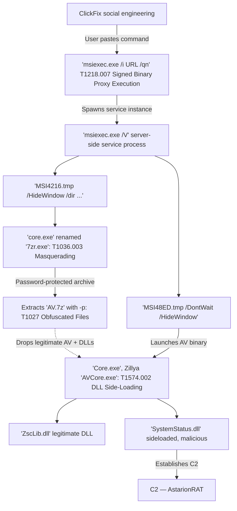

# How do I use this?
---
Go to [https://dataexplorer.azure.com](https://dataexplorer.azure.com), then create a free ADX cluster account and a new database. Copy the [init.kql](https://github.com/ksyeung/DetLabs/blob/main/python_pth_persistence/init.kql) data in this folder and paste it into the ADX web UI query window. This will create the required tables, ASIM parsers, helper functions, and start ingestion of the telemetry (WindowsEvent[...].parquet, etc).

### Matanbuchus Loader
This work is based on and supplemental to the Huntress investigation [ClickFix Won't Die. Neither Will Matanbuchus. A New RAT and a Hands-on-Keyboard Intrusion](https://www.huntress.com/blog/clickfix-matanbuchus-astarionrat-analysis). Unfortunately, we skip the ClickFix execution (the host is no longer up) and only cover the first loader due to lack of continued execution (the cause for this is unclear: perhaps sandbox checking identified our VM). There aren't any outgoing connection events by `core.exe` or the loaded DLLs, which would have been required for delivery of the second-stage AstarionRAT payload. This document assumes you've at least read through the end of the section `Step one: Trick the human` from the link!

The MSI was obtained from VirusTotal using the ClickFix URL described in the Huntress investigation. Note that this is currently detected by Defender:

```
Detected: Trojan:Script/Wacatac.H!ml
Status: Quarantined
Quarantined files are in a restricted area where they can't harm your device. They
will be removed automatically.

Date: 2/17/2026 1:16 AM
Details: This program is dangerous and executes commands from an attacker.

Affected items:
file: C:\Users\domainuser\AppData\Roaming\AegisLynx Cybernetics Ltd\AegisLynx Threat Fabric\AVU\ZAV\SystemStatus.dll
```



### The attack
The telemetry was collected from execution of the MSI. Let's get started.

File creation:
```kql
_ASim_FileEvent
| where FileName contains "4f50d6a520db0bcf43ebd8d5fda0245b9a74c788164c99a9236f4f11465a37af.msi"
| project
    EventStartTime, Dvc, EventProduct,ActorUsername, ActingProcessName, FilePath
```

| EventStartTime               | Dvc                          | EventProduct               | ActorUsername    | ActingProcessName       | FilePath                                                                                                                                                                |
| ---------------------------- | ---------------------------- | -------------------------- | ---------------- | ----------------------- | ----------------------------------------------------------------------------------------------------------------------------------------------------------------------- |
| 2026-02-17T01:12:13.808Z     | JD-WIN11-22H2-1.ludus.domain | Sysmon                     | ludus\domainuser | C:\Windows\Explorer.EXE | C:\Users\domainuser\Downloads\4f50d6a520db0bcf43ebd8d5fda0245b9a74c788164c99a9236f4f11465a37af.msi                                                                      |
| 2026-02-17T01:12:13.9959932Z | jd-win11-22h2-1.ludus.domain | M365 Defender for Endpoint | ludus\domainuser | c:\windows\explorer.exe | C:\Users\domainuser\Downloads\4f50d6a520db0bcf43ebd8d5fda0245b9a74c788164c99a9236f4f11465a37af.msi\4f50d6a520db0bcf43ebd8d5fda0245b9a74c788164c99a9236f4f11465a37af.msi |

Execution:
```kql
_ASim_ProcessEvent
| where CommandLine has "4f50d6a520db0bcf43ebd8d5fda0245b9a74c788164c99a9236f4f11465a37af.msi"
| project
    EventStartTime, Dvc, EventProduct, ActorUsername, TargetProcessName, TargetProcessId, TargetProcessCommandLine, ActingProcessName, ActingProcessCommandLine, ActingProcessId
```

As in the last query result, there are duplicates due to the union parser pulling events from MDE's DeviceProcessEvents and the WindowsEvent table.

| EventStartTime               | Dvc                          | EventProduct               | ActorUsername    | TargetProcessName               | TargetProcessId | TargetProcessCommandLine                                                                                                                  | ActingProcessName       | ActingProcessCommandLine | ActingProcessId |
| ---------------------------- | ---------------------------- | -------------------------- | ---------------- | ------------------------------- | --------------- | ----------------------------------------------------------------------------------------------------------------------------------------- | ----------------------- | ------------------------ | --------------- |
| 2026-02-17T01:12:19.002Z     | JD-WIN11-22H2-1.ludus.domain | Sysmon                     | ludus\domainuser | C:\Windows\System32\msiexec.exe | 10392           | "C:\Windows\System32\msiexec.exe" /i "C:\Users\domainuser\Downloads\4f50d6a520db0bcf43ebd8d5fda0245b9a74c788164c99a9236f4f11465a37af.msi" | C:\Windows\explorer.exe | C:\Windows\Explorer.EXE  | 9468            |
| 2026-02-17T01:12:20.3828214Z | jd-win11-22h2-1              | M365 Defender for Endpoint | ludus\domainuser | C:\Windows\System32\msiexec.exe | 10392           | "msiexec.exe" /i "C:\Users\domainuser\Downloads\4f50d6a520db0bcf43ebd8d5fda0245b9a74c788164c99a9236f4f11465a37af.msi"                     | c:\windows\explorer.exe | Explorer.EXE             | 9468            |

These two queries show that the user initiated download and install via `explorer.exe`, as opposed to e.g. `svchost.exe` Configuration Manager, Intune.

Let's look more closely:
```kql
_ASim_ProcessEvent
| where ProcessName endswith "msiexec.exe" or ParentProcessName endswith "msiexec.exe"
| project
	EventStartTime, Dvc, EventProduct, ActorUsername, TargetProcessName, TargetProcessId, TargetProcessCommandLine, ActingProcessName, ActingProcessCommandLine, ActingProcessId, ParentProcessName, ParentProcessCommandLine, ParentProcessId
```

| EventStartTime               | Dvc                          | EventProduct               | ActorUsername       | TargetProcessName                                                                                      | TargetProcessId | TargetProcessCommandLine                                                                                                                                                                                                     | ActingProcessName                | ActingProcessCommandLine                                                                                                                                                                                                                                                                                                                                                                                                                             | ActingProcessId | ParentProcessName | ParentProcessId |
| ---------------------------- | ---------------------------- | -------------------------- | ------------------- | ------------------------------------------------------------------------------------------------------ | --------------- | ---------------------------------------------------------------------------------------------------------------------------------------------------------------------------------------------------------------------------- | -------------------------------- | ---------------------------------------------------------------------------------------------------------------------------------------------------------------------------------------------------------------------------------------------------------------------------------------------------------------------------------------------------------------------------------------------------------------------------------------------------- | --------------- | ----------------- | --------------- |
| 2026-02-17T01:12:39.5023155Z | jd-win11-22h2-1              | M365 Defender for Endpoint | nt authority\system | C:\Windows\System32\conhost.exe                                                                        | 3836            | conhost.exe 0xffffffff -ForceV1                                                                                                                                                                                              | c:\windows\system32\srtasks.exe  | srtasks.exe ExecuteScopeRestorePoint /WaitForRestorePoint:3                                                                                                                                                                                                                                                                                                                                                                                          | 6696            | msiexec.exe       | 1004            |
| 2026-02-17T01:12:41.5163003Z | jd-win11-22h2-1              | M365 Defender for Endpoint | ludus\domainuser    | C:\Users\domainuser\AppData\Roaming\AegisLynx Cybernetics Ltd\AegisLynx Threat Fabric\AVU\core.exe     | 12576           | "core.exe" x "C:\Users\domainuser\AppData\Roaming\AegisLynx Cybernetics Ltd\AegisLynx Threat Fabric\AVU\AV.7z" -p********** -o"C:\Users\domainuser\AppData\Roaming\AegisLynx Cybernetics Ltd\AegisLynx Threat Fabric\AVU" -y | c:\windows\installer\msi4216.tmp | "MSI4216.tmp" /HideWindow /dir "C:\Users\domainuser\AppData\Roaming\AegisLynx Cybernetics Ltd\AegisLynx Threat Fabric\AVU" "C:\Users\domainuser\AppData\Roaming\AegisLynx Cybernetics Ltd\AegisLynx Threat Fabric\AVU\core.exe" x "C:\Users\domainuser\AppData\Roaming\AegisLynx Cybernetics Ltd\AegisLynx Threat Fabric\AVU\AV.7z" -pzav1224252026 -o"C:\Users\domainuser\AppData\Roaming\AegisLynx Cybernetics Ltd\AegisLynx Threat Fabric\AVU" -y | 604             | msiexec.exe       | 1004            |
| 2026-02-17T01:12:41.556Z     | JD-WIN11-22H2-1.ludus.domain | Security Events            | ludus\domainuser    | C:\Windows\System32\msiexec.exe                                                                        | 4               |                                                                                                                                                                                                                              |                                  |                                                                                                                                                                                                                                                                                                                                                                                                                                                      |                 |                   |                 |
| 2026-02-17T01:12:43.5220932Z | jd-win11-22h2-1              | M365 Defender for Endpoint | ludus\domainuser    | C:\Users\domainuser\AppData\Roaming\AegisLynx Cybernetics Ltd\AegisLynx Threat Fabric\AVU\ZAV\Core.exe | 13708           | "Core.exe"                                                                                                                                                                                                                   | c:\windows\installer\msi48ed.tmp | "MSI48ED.tmp" /DontWait /HideWindow "C:\Users\domainuser\AppData\Roaming\AegisLynx Cybernetics Ltd\AegisLynx Threat Fabric\AVU\ZAV\Core.exe"                                                                                                                                                                                                                                                                                                         | 12300           | msiexec.exe       | 1004            |

Note the 7z password in cleartext, and the `/HideWindow` and `/DontWait` flags passed to `MSI*.tmp`. Legitimate MSIs rarely suppress windows and detach execution.

The fields I chose for this query weren't very good, and there's missing data in the Sysmon data. Let's run a more targeted Sysmon query:
```kql
WindowsEvent
| where Provider == "Microsoft-Windows-Sysmon" and EventID == 1
| evaluate bag_unpack(EventData)
| where OriginalFileName == "msiexec.exe"
| project
    TimeGenerated, Computer, User, CommandLine, ProcessId, ParentImage, ParentProcessId
```

| TimeGenerated | Computer | User | CommandLine | ProcessId | ParentImage | ParentProcessId |
|---|---|---|---|---|---|---|
| 2026-02-17T01:12:19.002Z | JD-WIN11-22H2-1.ludus.domain | ludus\domainuser | "C:\Windows\System32\msiexec.exe" /i "C:\Users\domainuser\Downloads\4f50d6a520db0bcf43ebd8d5fda0245b9a74c788164c99a9236f4f11465a37af.msi" | 10392 | C:\Windows\explorer.exe | 9468 |
| 2026-02-17T01:12:19.408Z | JD-WIN11-22H2-1.ludus.domain | NT AUTHORITY\SYSTEM | C:\Windows\system32\msiexec.exe /V | 1004 | C:\Windows\System32\services.exe | 236 |

This fills in the gap and shows the MSI's role in the execution chain.

Now for the DLL sideloading:
```kql
DeviceImageLoadEvents
| where InitiatingProcessFileName == "core.exe"
| extend ActorUsername = strcat(InitiatingProcessAccountDomain, "\\", InitiatingProcessAccountName)
| project
    Timestamp, DeviceName, FileName, FolderPath, SHA1, ActorUsername, InitiatingProcessFileName, InitiatingProcessCommandLine, InitiatingProcessParentFileName, InitiatingProcessVersionInfoProductName
```

Output:

| Timestamp                    | DeviceName                   | FileName         | FolderPath                                                                                                     | SHA1                                     | ActorUsername    | InitiatingProcessFileName | InitiatingProcessCommandLine                                                                                                                                                                                                 | InitiatingProcessParentFileName | InitiatingProcessVersionInfoProductName |
| ---------------------------- | ---------------------------- | ---------------- | -------------------------------------------------------------------------------------------------------------- | ---------------------------------------- | ---------------- | ------------------------- | ---------------------------------------------------------------------------------------------------------------------------------------------------------------------------------------------------------------------------- | ------------------------------- | --------------------------------------- |
| 2026-02-17T01:12:40.5228776Z | jd-win11-22h2-1.ludus.domain | core.exe         | C:\Users\domainuser\AppData\Roaming\AegisLynx Cybernetics Ltd\AegisLynx Threat Fabric\AVU\core.exe             | 8c95c825f7385487811cc2ee4b08d5e44da88b7a | ludus\domainuser | core.exe                  | "core.exe" x "C:\Users\domainuser\AppData\Roaming\AegisLynx Cybernetics Ltd\AegisLynx Threat Fabric\AVU\AV.7z" -p********** -o"C:\Users\domainuser\AppData\Roaming\AegisLynx Cybernetics Ltd\AegisLynx Threat Fabric\AVU" -y | MSI4216.tmp                     | 7-Zip                                   |
| 2026-02-17T01:12:41.9299932Z | jd-win11-22h2-1.ludus.domain | Core.exe         | C:\Users\domainuser\AppData\Roaming\AegisLynx Cybernetics Ltd\AegisLynx Threat Fabric\AVU\ZAV\Core.exe         | 1effbccbc0491f1d0fe37a61ef8630263ad60e13 | ludus\domainuser | core.exe                  | "Core.exe"                                                                                                                                                                                                                   | MSI48ED.tmp                     | Zillya Antivirus                        |
| 2026-02-17T01:12:42.0267883Z | jd-win11-22h2-1.ludus.domain | ZscLib.dll       | C:\Users\domainuser\AppData\Roaming\AegisLynx Cybernetics Ltd\AegisLynx Threat Fabric\AVU\ZAV\ZscLib.dll       | 7dbdeef1ecbfb67167e574977f4fe54f063206ec | ludus\domainuser | core.exe                  | "Core.exe"                                                                                                                                                                                                                   | MSI48ED.tmp                     | Zillya Antivirus                        |
| 2026-02-17T01:12:42.1186061Z | jd-win11-22h2-1.ludus.domain | SystemStatus.dll | C:\Users\domainuser\AppData\Roaming\AegisLynx Cybernetics Ltd\AegisLynx Threat Fabric\AVU\ZAV\SystemStatus.dll | 15c981edd80201bad9a387f08748f975e710561f | ludus\domainuser | core.exe                  | "Core.exe"                                                                                                                                                                                                                   | MSI48ED.tmp                     | Zillya Antivirus                        |

This shows the two-stage payload extraction. Row 1 shows `core.exe` (7-Zip) extracting `AV.7z`, a decompression step spawned by `MSI4216.tmp`. Rows 2–4 show a different `Core.exe` (Zillya Antivirus) spawned by `MSI48ED.tmp`, which then drops `ZscLib.dll` and `SystemStatus.dll` into the `ZAV\` subdir.

Two `core.exe` binaries exist with different SHA1 hashes and product names. The MSI uses a legitimate 7-Zip binary to unpack then launches a second legitimate binary (Zillya Antivirus) masquerading under the same filename. The DLL sideloading here is consistent with known TA TTPs: a signed and legitimate executable loads a malicious DLL `SystemStatus.dll` from the same dir.

We can also look at this with just Sysmon events. Since we have the benefit of results from the prior query, we'll examine events for `core.exe` loading unsigned DLLs:
```kql
WindowsEvent
| where Provider == "Microsoft-Windows-Sysmon" and EventID == 7
| evaluate bag_unpack(EventData)
| where Image endswith "core.exe" and SignatureStatus != "Valid"
| project
    TimeGenerated, Computer, User, OriginalFileName, Image, ProcessId, ImageLoaded
```

Output:

| TimeGenerated            | Computer                     | User             | OriginalFileName | Image                                                                                                  | ProcessId | ImageLoaded                                                                                                    |
| ------------------------ | ---------------------------- | ---------------- | ---------------- | ------------------------------------------------------------------------------------------------------ | --------- | -------------------------------------------------------------------------------------------------------------- |
| 2026-02-17T01:12:40.535Z | JD-WIN11-22H2-1.ludus.domain | ludus\domainuser | 7zr.exe          | C:\Users\domainuser\AppData\Roaming\AegisLynx Cybernetics Ltd\AegisLynx Threat Fabric\AVU\core.exe     | 12576     | C:\Users\domainuser\AppData\Roaming\AegisLynx Cybernetics Ltd\AegisLynx Threat Fabric\AVU\core.exe             |
| 2026-02-17T01:12:42.706Z | JD-WIN11-22H2-1.ludus.domain | ludus\domainuser | -                | C:\Users\domainuser\AppData\Roaming\AegisLynx Cybernetics Ltd\AegisLynx Threat Fabric\AVU\ZAV\Core.exe | 13708     | C:\Users\domainuser\AppData\Roaming\AegisLynx Cybernetics Ltd\AegisLynx Threat Fabric\AVU\ZAV\SystemStatus.dll |

`SystemStatus.dll` is missing an `OriginalFileName` which indicates the DLL doesn't have a version resource block (or maybe it was compiled without one). Sysmon populates this field using the PE version resource block and it persists through file renames. This is unusual for legitimate software.

### Detection
I think there are a few possible detections here, ranging widely in value. We'll start with existing Sigma rules from SigmaHQ.

MSI silent install from URL: [proc_creation_win_msiexec_install_remote.yml](https://github.com/SigmaHQ/sigma/blob/master/rules/windows/process_creation/proc_creation_win_msiexec_install_remote.yml)

MSI silent install: [proc_creation_win_msiexec_install_quiet.yml](https://github.com/SigmaHQ/sigma/blob/master/rules/windows/process_creation/proc_creation_win_msiexec_install_quiet.yml)

Execution of a renamed binary often used by attackers, using Sysmon's OriginalFileName: [proc_creation_win_renamed_binary.yml](https://github.com/SigmaHQ/sigma/blob/master/rules/windows/process_creation/proc_creation_win_renamed_binary.yml)

Enhanced detection of renamed binaries: [proc_creation_win_renamed_binary_highly_relevant.yml](https://github.com/SigmaHQ/sigma/blob/master/rules/windows/process_creation/proc_creation_win_renamed_binary_highly_relevant.yml)

Password-protected 7zip archive extraction: [proc_creation_win_7zip_password_compression.yml](https://github.com/SigmaHQ/sigma/blob/master/rules/windows/process_creation/proc_creation_win_7zip_password_compression.yml)


There is also the rule `Potential Antivirus Software DLL Sideloading` which does not currently include Zillya Antivirus: [image_load_side_load_antivirus.yml](https://github.com/SigmaHQ/sigma/blob/master/rules/windows/image_load/image_load_side_load_antivirus.yml). If you wanted to use this rule, you'd add `Core.exe`, `AVCore.exe`, and `SystemStatus.dll`. I've submitted a PR.

The MSI detections are likely to produce a lot of noise. You'll likely want to filter for parent process (`cmd.exe` or `powershell.exe` from a user session vs a deployment agent) and child process behaviour (`msiexec.exe` spawning script interpreters or archive utilities).

The MSI extracts binaries into `C:\Windows\Installer\MSI<hex>.tmp` files, which deploy payloads and pass `/HideWindow` and `/DontWait` for stealth. These arguments may be used in your environment, so baselining then excluding known installer paths is advised. When run from `cmd.exe` or `powershell.exe` with a user session, this suggests ClickFix-style paste execution.

```kql
_ASim_ProcessEvent
| where EventType == "ProcessCreated"
| where ActingProcessName matches regex @"(?i)\\Windows\\Installer\\MSI[A-F0-9]+\.tmp$"
| where ActingProcessCommandLine has_any ("/HideWindow", "/DontWait")
| project
    EventStartTime, Dvc, EventProduct, ActorUsername, TargetProcessName, TargetProcessId, TargetProcessCommandLine, ActingProcessName, ActingProcessCommandLine, ParentProcessName,ParentProcessId
```

Output:

| EventStartTime               | Dvc                          | EventProduct               | ActorUsername    | TargetProcessName                                                                                      | TargetProcessId | TargetProcessCommandLine                                                                                                                                                                                                                                                                                                  | ActingProcessName                | ActingProcessCommandLine                                                                                                                                                                                                                                                                                                                                                                                                                                                  | ParentProcessName | ParentProcessId |
| ---------------------------- | ---------------------------- | -------------------------- | ---------------- | ------------------------------------------------------------------------------------------------------ | --------------- | ------------------------------------------------------------------------------------------------------------------------------------------------------------------------------------------------------------------------------------------------------------------------------------------------------------------------- | -------------------------------- | ------------------------------------------------------------------------------------------------------------------------------------------------------------------------------------------------------------------------------------------------------------------------------------------------------------------------------------------------------------------------------------------------------------------------------------------------------------------------- | ----------------- | --------------- |
| 2026-02-17T01:12:40.498Z     | JD-WIN11-22H2-1.ludus.domain | Sysmon                     | ludus\domainuser | C:\Users\domainuser\AppData\Roaming\AegisLynx Cybernetics Ltd\AegisLynx Threat Fabric\AVU\core.exe     | 12576           | "C:\Users\domainuser\AppData\Roaming\AegisLynx Cybernetics Ltd\AegisLynx Threat Fabric\AVU\core.exe" x "C:\Users\domainuser\AppData\Roaming\AegisLynx Cybernetics Ltd\AegisLynx Threat Fabric\AVU\AV.7z" -pzav1224252026 -o"C:\Users\domainuser\AppData\Roaming\AegisLynx Cybernetics Ltd\AegisLynx Threat Fabric\AVU" -y | C:\Windows\Installer\MSI4216.tmp | "C:\Windows\Installer\MSI4216.tmp" /HideWindow /dir "C:\Users\domainuser\AppData\Roaming\AegisLynx Cybernetics Ltd\AegisLynx Threat Fabric\AVU" "C:\Users\domainuser\AppData\Roaming\AegisLynx Cybernetics Ltd\AegisLynx Threat Fabric\AVU\core.exe" x "C:\Users\domainuser\AppData\Roaming\AegisLynx Cybernetics Ltd\AegisLynx Threat Fabric\AVU\AV.7z" -pzav1224252026 -o"C:\Users\domainuser\AppData\Roaming\AegisLynx Cybernetics Ltd\AegisLynx Threat Fabric\AVU" -y |                   |                 |
| 2026-02-17T01:12:41.5163003Z | jd-win11-22h2-1              | M365 Defender for Endpoint | ludus\domainuser | C:\Users\domainuser\AppData\Roaming\AegisLynx Cybernetics Ltd\AegisLynx Threat Fabric\AVU\core.exe     | 12576           | "core.exe" x "C:\Users\domainuser\AppData\Roaming\AegisLynx Cybernetics Ltd\AegisLynx Threat Fabric\AVU\AV.7z" -p********** -o"C:\Users\domainuser\AppData\Roaming\AegisLynx Cybernetics Ltd\AegisLynx Threat Fabric\AVU" -y                                                                                              | c:\windows\installer\msi4216.tmp | "MSI4216.tmp" /HideWindow /dir "C:\Users\domainuser\AppData\Roaming\AegisLynx Cybernetics Ltd\AegisLynx Threat Fabric\AVU" "C:\Users\domainuser\AppData\Roaming\AegisLynx Cybernetics Ltd\AegisLynx Threat Fabric\AVU\core.exe" x "C:\Users\domainuser\AppData\Roaming\AegisLynx Cybernetics Ltd\AegisLynx Threat Fabric\AVU\AV.7z" -pzav1224252026 -o"C:\Users\domainuser\AppData\Roaming\AegisLynx Cybernetics Ltd\AegisLynx Threat Fabric\AVU" -y                      | msiexec.exe       | 1004            |
| 2026-02-17T01:12:41.913Z     | JD-WIN11-22H2-1.ludus.domain | Sysmon                     | ludus\domainuser | C:\Users\domainuser\AppData\Roaming\AegisLynx Cybernetics Ltd\AegisLynx Threat Fabric\AVU\ZAV\Core.exe | 13708           | "C:\Users\domainuser\AppData\Roaming\AegisLynx Cybernetics Ltd\AegisLynx Threat Fabric\AVU\ZAV\Core.exe"                                                                                                                                                                                                                  | C:\Windows\Installer\MSI48ED.tmp | "C:\Windows\Installer\MSI48ED.tmp" /DontWait /HideWindow "C:\Users\domainuser\AppData\Roaming\AegisLynx Cybernetics Ltd\AegisLynx Threat Fabric\AVU\ZAV\Core.exe"                                                                                                                                                                                                                                                                                                         |                   |                 |
| 2026-02-17T01:12:43.5220932Z | jd-win11-22h2-1              | M365 Defender for Endpoint | ludus\domainuser | C:\Users\domainuser\AppData\Roaming\AegisLynx Cybernetics Ltd\AegisLynx Threat Fabric\AVU\ZAV\Core.exe | 13708           | "Core.exe"                                                                                                                                                                                                                                                                                                                | c:\windows\installer\msi48ed.tmp | "MSI48ED.tmp" /DontWait /HideWindow "C:\Users\domainuser\AppData\Roaming\AegisLynx Cybernetics Ltd\AegisLynx Threat Fabric\AVU\ZAV\Core.exe"                                                                                                                                                                                                                                                                                                                              | msiexec.exe       | 1004            |

The loader uses a renamed 7zip binary to extract a password-protected .7z archive into a user-writable dir:
```kql
_ASim_ProcessEvent
| where EventType == "ProcessCreated"
| where TargetProcessCommandLine matches regex @"(?i)\bx\b.+\.(7z|zip|rar|cab)\b.*\s-p[^\s\-]"
| where TargetProcessCommandLine has_any (
    "\\AppData\\", "\\ProgramData\\", "\\Users\\", "\\Temp\\", 
    "\\Downloads\\", "\\Desktop\\", "\\Documents\\", "\\Public\\"
)
| project
    EventStartTime, Dvc, EventProduct, ActorUsername, TargetProcessName, TargetProcessId, TargetProcessCommandLine, ActingProcessName, ActingProcessCommandLine, ParentProcessName, ParentProcessId
```

Output:

|EventStartTime|Dvc|EventProduct|ActorUsername|TargetProcessName|TargetProcessId|TargetProcessCommandLine|ActingProcessName|ActingProcessCommandLine|ParentProcessName|ParentProcessId|
|---|---|---|---|---|---|---|---|---|---|---|
|2026-02-17T01:12:39.615Z|JD-WIN11-22H2-1.ludus.domain|Sysmon|NT AUTHORITY\SYSTEM|C:\Windows\Installer\MSI4216.tmp|604|"C:\Windows\Installer\MSI4216.tmp" /HideWindow /dir "C:\Users\domainuser\AppData\Roaming\AegisLynx Cybernetics Ltd\AegisLynx Threat Fabric\AVU" "C:\Users\domainuser\AppData\Roaming\AegisLynx Cybernetics Ltd\AegisLynx Threat Fabric\AVU\core.exe" x "C:\Users\domainuser\AppData\Roaming\AegisLynx Cybernetics Ltd\AegisLynx Threat Fabric\AVU\AV.7z" -pzav1224252026 -o"C:\Users\domainuser\AppData\Roaming\AegisLynx Cybernetics Ltd\AegisLynx Threat Fabric\AVU" -y|C:\Windows\System32\msiexec.exe|C:\Windows\system32\msiexec.exe /V|||
|2026-02-17T01:12:40.498Z|JD-WIN11-22H2-1.ludus.domain|Sysmon|ludus\domainuser|C:\Users\domainuser\AppData\Roaming\AegisLynx Cybernetics Ltd\AegisLynx Threat Fabric\AVU\core.exe|12576|"C:\Users\domainuser\AppData\Roaming\AegisLynx Cybernetics Ltd\AegisLynx Threat Fabric\AVU\core.exe" x "C:\Users\domainuser\AppData\Roaming\AegisLynx Cybernetics Ltd\AegisLynx Threat Fabric\AVU\AV.7z" -pzav1224252026 -o"C:\Users\domainuser\AppData\Roaming\AegisLynx Cybernetics Ltd\AegisLynx Threat Fabric\AVU" -y|C:\Windows\Installer\MSI4216.tmp|"C:\Windows\Installer\MSI4216.tmp" /HideWindow /dir "C:\Users\domainuser\AppData\Roaming\AegisLynx Cybernetics Ltd\AegisLynx Threat Fabric\AVU" "C:\Users\domainuser\AppData\Roaming\AegisLynx Cybernetics Ltd\AegisLynx Threat Fabric\AVU\core.exe" x "C:\Users\domainuser\AppData\Roaming\AegisLynx Cybernetics Ltd\AegisLynx Threat Fabric\AVU\AV.7z" -pzav1224252026 -o"C:\Users\domainuser\AppData\Roaming\AegisLynx Cybernetics Ltd\AegisLynx Threat Fabric\AVU" -y|||
|2026-02-17T01:12:40.5363716Z|jd-win11-22h2-1|M365 Defender for Endpoint|nt authority\system|C:\Windows\Installer\MSI4216.tmp|604|"MSI4216.tmp" /HideWindow /dir "C:\Users\domainuser\AppData\Roaming\AegisLynx Cybernetics Ltd\AegisLynx Threat Fabric\AVU" "C:\Users\domainuser\AppData\Roaming\AegisLynx Cybernetics Ltd\AegisLynx Threat Fabric\AVU\core.exe" x "C:\Users\domainuser\AppData\Roaming\AegisLynx Cybernetics Ltd\AegisLynx Threat Fabric\AVU\AV.7z" -pzav1224252026 -o"C:\Users\domainuser\AppData\Roaming\AegisLynx Cybernetics Ltd\AegisLynx Threat Fabric\AVU" -y|c:\windows\system32\msiexec.exe|msiexec.exe /V|services.exe|236|
|2026-02-17T01:12:41.5163003Z|jd-win11-22h2-1|M365 Defender for Endpoint|ludus\domainuser|C:\Users\domainuser\AppData\Roaming\AegisLynx Cybernetics Ltd\AegisLynx Threat Fabric\AVU\core.exe|12576|"core.exe" x "C:\Users\domainuser\AppData\Roaming\AegisLynx Cybernetics Ltd\AegisLynx Threat Fabric\AVU\AV.7z" -p********** -o"C:\Users\domainuser\AppData\Roaming\AegisLynx Cybernetics Ltd\AegisLynx Threat Fabric\AVU" -y|c:\windows\installer\msi4216.tmp|"MSI4216.tmp" /HideWindow /dir "C:\Users\domainuser\AppData\Roaming\AegisLynx Cybernetics Ltd\AegisLynx Threat Fabric\AVU" "C:\Users\domainuser\AppData\Roaming\AegisLynx Cybernetics Ltd\AegisLynx Threat Fabric\AVU\core.exe" x "C:\Users\domainuser\AppData\Roaming\AegisLynx Cybernetics Ltd\AegisLynx Threat Fabric\AVU\AV.7z" -pzav1224252026 -o"C:\Users\domainuser\AppData\Roaming\AegisLynx Cybernetics Ltd\AegisLynx Threat Fabric\AVU" -y|msiexec.exe|1004|


A generic detection for this situation is checking for sideloaded, unsigned DLLs being loaded by legitimate binaries. Depending on your environment, this could be exceptionally noisy - I think Electron apps among others routinely load unsigned DLLs. To account for this, you could exclude them with path-based allowlists and signature checking. That has risks, of course.

```kql
WindowsEvent
| where Provider == "Microsoft-Windows-Sysmon" and EventID == 7
// cheap string filter before any parsing
| where EventData has "false" and EventData has ".dll"
| extend d = parse_json(EventData)
| extend
    User            = tostring(d.User),
    Image           = tostring(d.Image),
    ImageLoaded     = tostring(d.ImageLoaded),
    Signed          = tostring(d.Signed),
    SignatureStatus = tostring(d.SignatureStatus),
    ProcessId       = tostring(d.ProcessId),
    Hashes          = tostring(d.Hashes)
| where ImageLoaded endswith ".dll"
    and Signed == "false"
    and SignatureStatus != "Valid"
// may not be necessary in your env
| where ImageLoaded !in~ (
    "C:\\Windows\\System32\\rpcFireWall.dll",
    "C:\\Windows\\System32\\rpcMessages.dll"
)
// sideloading heuristic: process and loaded DLL share the same dir
| extend ImageDir  = extract(@"^(.*\\)", 1, Image),
         LoadedDir = extract(@"^(.*\\)", 1, ImageLoaded)
| where ImageDir =~ LoadedDir
| extend LoadingProcessName = tolower(extract(@"[^\\]+$", 0, Image))
| project
    TimeGenerated, Computer, User, Image, LoadingProcessName, ProcessId, ImageLoaded, Hashes
```

Output:

|TimeGenerated|Computer|User|Image|LoadingProcessName|ProcessId|ImageLoaded|SHA1|MD5|SHA256|IMPHASH|
|---|---|---|---|---|---|---|---|---|---|---|
|2026-02-17T01:12:42.706Z|JD-WIN11-22H2-1.ludus.domain|ludus\domainuser|C:\Users\domainuser\AppData\Roaming\AegisLynx Cybernetics Ltd\AegisLynx Threat Fabric\AVU\ZAV\Core.exe|core.exe|13708|C:\Users\domainuser\AppData\Roaming\AegisLynx Cybernetics Ltd\AegisLynx Threat Fabric\AVU\ZAV\SystemStatus.dll|15C981EDD80201BAD9A387F08748F975E710561F|5335961C9CB9A8B38B6740ABB33B3F2F|EC29BCDA7D42D812AEBD2EE5BE6E43256BCF6095B9FC36F92EEC5D6475DD5E1F|868696B59ABD2FE5F9FCEF0183BF13C4|

### Other notes
- MDE masks the 7z password while Sysmon logs it in cleartext.
- MDE strips full paths from command-lines in some contexts, while Sysmon preserves them. This can affect detection logic.
- MDE's `DeviceImageLoadEvents` has known capping limitations, and DLL load events may not appear consistently. Sysmon data is ideal for DLL sideloading detections. It also has `SignatureStatus` and `Signed` fields that MDE does not.
